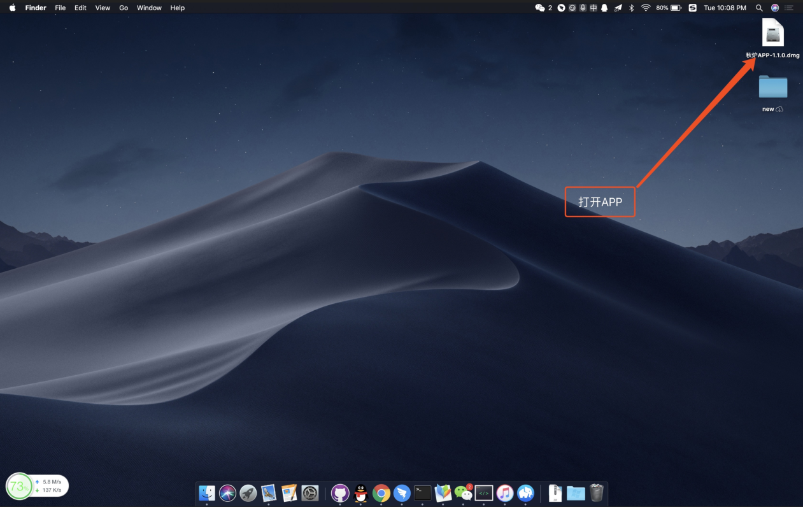
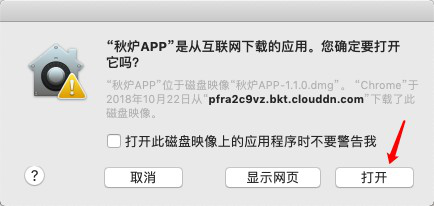
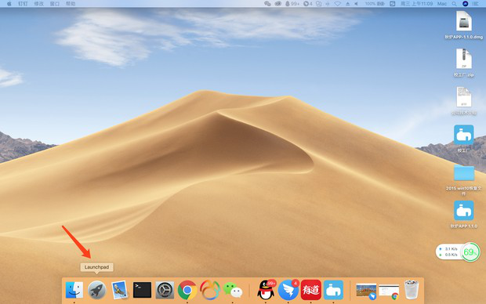

# 安装步骤

## 秋炉APP



1.找到并打开APP  

2.右键APP,选择open/打开  

3.选择打开  


MAC安装成功


以后使用APP的时候,只需要在Launchpad中找到秋炉APP,双击打开即可,无需再安装  




1.找到并点击APP  

2.双击打开安装包即可


Windows安装完成




## 秋炉考勤APP

1.在应用商店搜"秋炉考勤APP"点击安装即可

