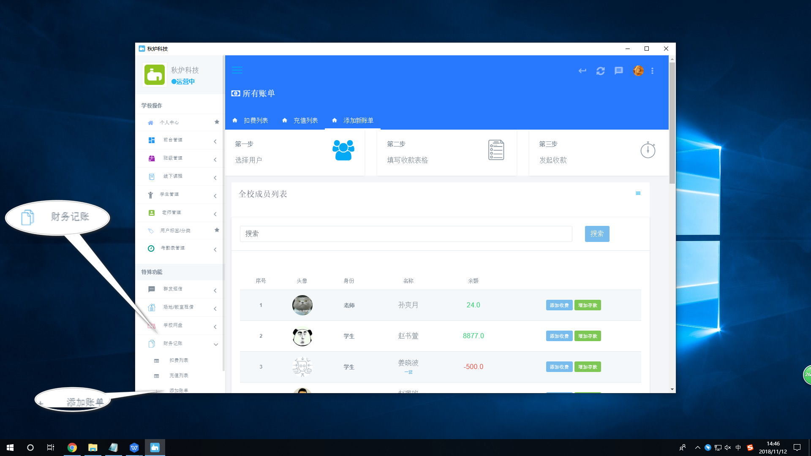
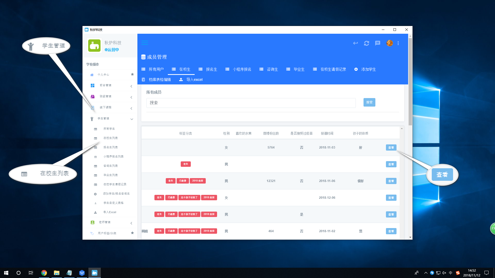
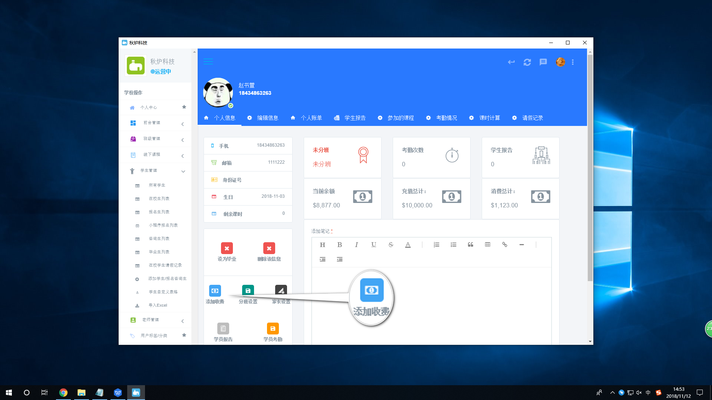
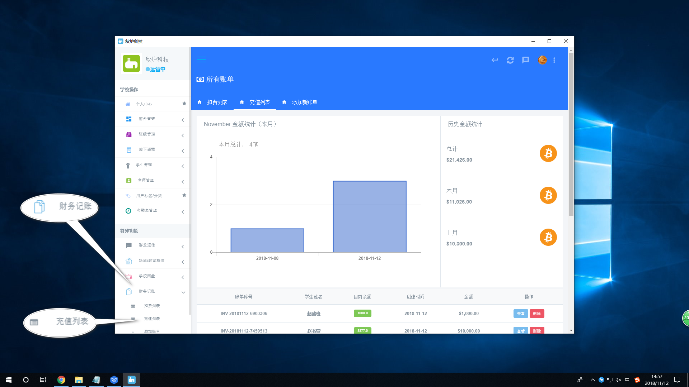

# 财务管理

1.添加新账单

方法一:针对于每个师生,添加收费或存款

【财务记账】&gt; 添加账单  

方法二:针对于个别学生的收费

【学生管理】&gt; 在校生列表 &gt; 选择指定的学生,点击"查看"按钮  

2.展示扣费列表:【财务记账】&gt; 扣费列表


上面表格展示的是本月每天的扣费次数以及右边展示的是所有的扣费金额和本月的扣费金额


3.展示充值列表:【财务记账】&gt; 充值列表  


可以点击"查看"按钮,查看每个学生的充值详情 表格展示的是本月每天的充值次数以及右边展示的是所有的充值金额和本月的充值金额


