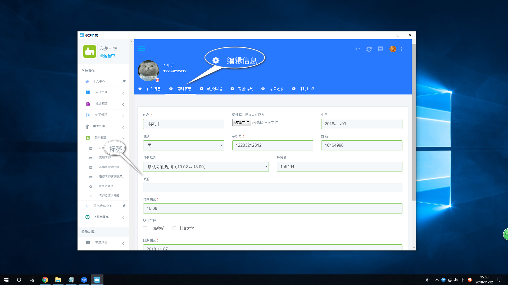

# 其他方面

##  场地租借

1.添加场地:【场地/教室租借】&gt; 添加场地  

2.场地展示:【场地/教室租借】&gt; 场地列表  


这个页面可以看到您预约的时间,预约的场地总个数以及一个场地的房间数


3.场地添加房间

方法一: 【场地/教室租借】&gt; 场地列表 &gt; 选取指定的场地,点击"操作"按钮

方法二: 【场地/教室租借】&gt; 场地列表 &gt; 选取指定的场地,点击"操作"按钮

4.添加房间的时间以及指定的人 :【场地/教室租借】&gt; 场地列表 &gt; 选取指定的场地,点击"操作"按钮

在页面的表格中,选取指定的房间名,相对应后面的时间,然后双击,弹出个框

## 标签管理

1.添加标签:【用户标签/分类】  


点击"添加新标签"按钮,进行添加,若想要修改标签,点击标签旁边的"编辑"按钮


2.使用标签

方法一:在添加老师或学生信息时,选择指定的标签进行添加

方法二:【用户标签/分类】&gt; 选择指定的人后点击"查看"按钮 &gt; 编辑信息 选择指定的标签,点击提交即可


这主要针对于个别需要添加的


方法三:【学生管理】&gt; 所有学生


点击全选按钮,会出现"批量添加标签"按钮,点击进行批量添加


## 短信通知

1.新建群发模板:【短信群发】&gt; 新建短信群发模板  


请严格按照上面的温馨提示,不然短信模板可能通不过


2.新建自定义模板:【短信群发】&gt; 新建短信


可以选择发送老师还是学生


3.短信发送记录:【短信群发】&gt;群发记录

4.短信使用情况:【短信群发】&gt; 短信报告


上面记录短信使用记录以及短信使用条数和剩余条数


