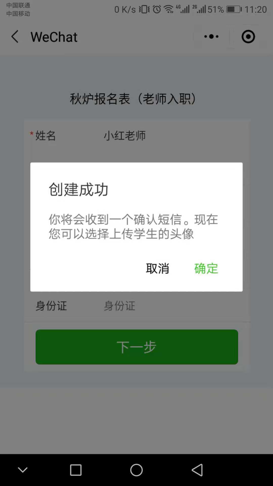

# 学前准备

## 班级创建

1.添加班级:【班级管理】&gt; 添加班级  

2.班级展示

进行中班级:【班级管理】&gt; 进行中班级  


如果添加班级时,**开始日期&lt;今天日期&lt;结束日期**,则在进行中班级展示


未开班班级:【班级管理】&gt; 未开班班级  


如果添加班级时,**今天日期&lt;开始日期&lt;结束日期**,则在未开班班级展示


已到期班级:【班级管理】&gt; 已到期班级  


如果添加班级时,**开始日期&lt;结束日期&lt;今天日期**,则在已到期班级展示


3.查看班级详情信息:【班级管理】&gt; 进行中班级 &gt; 选择指定班级,点击 打开 按钮 &gt; 班级详情  

4.修改班级信息 :【班级管理】&gt; 进行中班级 &gt; 选择指定班级,点击 打开 按钮 &gt; 修改信息


"设置已归档班级"按钮,只能点击一次,是不可逆的


若设为归档班级,则可以在**【班级管理】&gt; 已归档班级** 中查看  

## 课程创建

1.添加课程:【线下课程】&gt; 添加课程  


可以选择1V多,1V1,还是无班级


2.课程展示

进行中课程:【线下课程】&gt; 进行中课程  

已过期课程:【线下课程】&gt;已过期课程   

课程基本信息查看:【线下课程】&gt; 课程报表   

## 老师管理

1.添加老师

方法一:PC登记

添加老师:【老师管理】&gt; 添加新老师  


\*为必填项


设置老师自定义表格:【老师管理】&gt; 老师自定义表格  


上面的基础信息,是不能点击的


方法二:小程序报名

【个人中心】  


打开微信,扫描上方的二维码进行报名


扫描成功后,进入到小程序报名页面  

 


\*为必填项


 


可以点击确定来选择头像,或者点击取消表示报名完成 此时您所填的手机将会收到一条短信


 


点击上一步的确定按钮,才能来到上传头像页面



小程序老师报名成功


2.老师信息展示

PC报名的老师:【老师管理】&gt;在校老师  

小程序报名的老师:【老师管理】&gt;小程序报名老师    

3.修改老师信息:【老师管理】&gt; 在校老师 &gt; 选择指定的老师,点击 查看 按钮 &gt; 编辑信息  

4.教授课程:【老师管理】&gt; 在校老师 &gt; 选择指定的老师,点击 查看 按钮 &gt;教授课程


用于查看这个老师最近教授那些课程


5.设为离职:【老师管理】&gt; 在校老师 &gt; 选择指定的老师,点击"查看"按钮  

6.查看离职老师:【老师管理】&gt; 离职老师

7.删除老师信息

方法一:【老师管理】&gt; 离职老师 &gt; 选择指定的老师,点击"查看"按钮 

方法二:【老师管理】&gt; 在校老师 &gt; 选择指定的老师,点击"查看"按钮 

