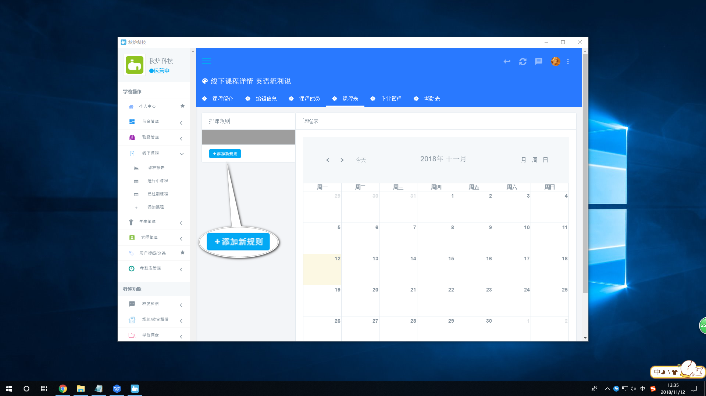
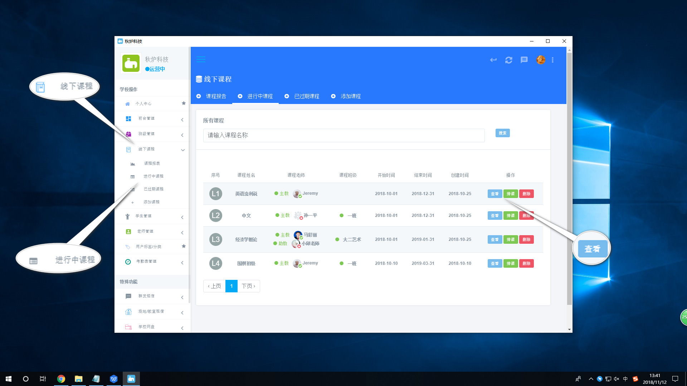

# 学生入校

## 学生管理

1.添加学生

方法一:教师进行PC登记

【学生管理】&gt; 添加学生/报名资讯生  


\*为必填项,上传证件照时,注意要上传自己的头像,便于以后的考勤打卡


方法二:小程序报名

【个人中心】  


扫描上方的二维码,进行报名


扫描成功后,进入到小程序页面  

 


\*为必填项



可以点击确定来选择头像,或者点击取消表示报名成功,此时您将会收到一条短信



点击上一步的确定来到上传头像这一步,头像注意要上传自己真实的头像,便于以后的考勤打卡



学生小程序报名成功


方法三:导入EXECL表

【学生管理】&gt; 导入EXECL  


点击"下载样板EXECL"按钮下载一个模板,填入信息后,再点击"新增导入"按钮进行导入


2.学生展示

PC端报名的学生:

添加学生时身份为咨询生:【学生管理】&gt; 咨询生列表  

添加学生时身份为报名生:【学生管理】&gt; 报名生列表   

添加学生时身份为学生:【学生管理】&gt; 在校生列表   


EXECL导入的信息也在此展示


小程序报名的学生:  

查看所有学生的信息:【学生管理】&gt; 所有学生   

3.修改信息:【学生管理】&gt; 在校生列表 &gt; 选择指定学生,点击"查看"按钮 &gt; 编辑信息  

4.转为在校生:【学生管理】&gt; 报名生列表 &gt; 选择指定学生,点击"查看"按钮


添加时选择的身份不同,点击的页面不同


## 新生分班

方法一:添加学生时,直接选择好班级

方法二:【学生管理】&gt; 在校生列表 &gt; 选择指定学生,点击"查看"按钮 &gt; 编辑信息  

方法三: 【班级管理】&gt; 进行中班级 &gt; 选择指定班级,点击"打开"按钮 &gt; 学生管理  


选择指定的学生,进行添加即可


方法四:【学生管理】&gt; 在校生列表


点击全选按钮,会出现"批量添加班级"按钮,可以点击进行批量添加班级


## 课程排课

主要针对于线下:【线下课程】&gt; 进行中课程 &gt; 选择需要排的课,点击 排课 按钮  


点击按钮进行排课,今天排的课,将会在00点后生效,右侧的日历将近期的课程排课情况展示出来


## 作业布置

针对于课堂\(一堂课\):【线下管理】&gt; 进行中课程 &gt; 选择指定的课程,点击 查看 按钮 &gt; 作业管理 点击 添加作业 按钮,来进行布置作业  


点击"添加作业"按钮进行布置作业,作业一旦布置,所有学生都将会收到;此页面还可以用来查看其它作业学生的完成情况,想要修改个别学生的作业完成情况,点击"查看"按钮,进行修改


针对于班级:【班级管理】&gt; 进行中班级 &gt; 选择指定的班级,点击 打开 按钮 &gt; 作业管理  


点击"添加作业"进行布置作业,作业一旦布置,所有学生都将会收到;此页面还可以用来查看班级其它作业学生的完成情况,想要修改个别学生的作业完成情况,点击"查看"按钮,进行修改


## 请假记录

1.申请请假:

学生:【学生管理】&gt; 在校生生列表 &gt; 选择指定的学生,点击 查看 按钮 &gt; 请假记录


点击"申请请假"按钮,进行请假


老师:【老师管理】&gt; 在校老师 &gt; 找到自己,点击 查看 按钮\(如果你的身份为老师\) &gt; 请假记录  


老师不可以代假,只能自己给自己请假


2.查看所有在校学生/老师的请假记录

学生:【学生管理】&gt; 在校学生请假记录  

老师:【老师管理】&gt; 在校老师请假记录   

## 课时计算

【学生管理】&gt; 在校生列表 &gt; 选择指定学生,点击 查看 按钮 &gt; 课时计算  


点击"添加课时"按钮,进行添加课时


## 考勤打卡

考勤是通过在添加学生/老师时,上传的头像进行人脸识别,打卡考勤

1.新建考勤:【考勤表管理】&gt;新建上下学报告  

2.人脸打卡:使用秋炉考勤APP进行人脸识别打卡

3.查看考勤

    针对于所有的考勤规则报告设置:【考勤表管理】&gt;上学/放学考勤报告   

     针对于一个班的考勤情况:【班级管理】&gt; 进行中班级 &gt; 选择指定班级,点击 查看 按钮 &gt;学生考勤表

     针对于课程考勤报告:【考勤表管理】&gt; 课程考勤    


点击"查看"按钮,可以查看课程考勤详情


      针对于单独一个老师/学生的考勤情况

 老师:

方法一:【老师管理】&gt;在校老师 &gt; 选择指定老师,点击 查看 按钮 &gt;考勤情况  

方法二:【老师管理】&gt;在校老师 &gt; 选择指定老师,点击 查看 按钮


可以用来预览老师的大概考勤情况


学生:【学生管理】&gt;在校生列表 &gt; 选择指定学生,点击 查看 按钮 &gt;考勤报告  

      针对于今天上/放学的学生大概考勤情况

【前台管理】&gt; 今日考勤  

## 学生毕业

1.设为毕业生:【学生管理】&gt; 在校生列表 &gt; 选择指定学生,点击"查看"按钮  


点击"设为毕业"按钮,即为毕业


2.查看毕业生:【学生管理】&gt; 毕业生列表

